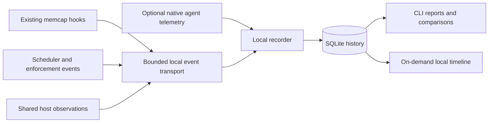

# Local performance analytics for memcap

Proposed design, September 29, 2026. This document does not enable a collector,
change agent profiles, alter enforcement, or authorize automatic policy changes.

## Product objective

Complete useful agent-assisted work promptly while keeping the Mac usable and
avoiding disruptive memory incidents. Lower memory usage alone is not success.
Neither more tool calls nor more completed agent turns proves more useful work.

Evaluate every change on three separate axes:

1. Developer progress: comparable work completion, latency, and friction.
2. Machine health: pressure, current paging, responsiveness, and disruptions.
3. Measurement quality and observer cost: coverage, missing data, CPU, memory,
   storage, and hook overhead introduced by analytics itself.

Do not collapse these into one weighted score that can conceal a severe delay or
termination behind a small improvement in memory usage. Prefer a change that
improves one axis without materially worsening the other. A real tradeoff should
be visible and chosen by the owner.

## What exists and what is missing

`libexec/scheduler_metrics.py` records private numeric JSONL events for host
samples, admissions, completions, stalls, and reservation adjustments. Records
include a numeric release version and job reference. The writer is best effort,
nonblocking on its own lock, with two bounded segments and approximately one-day
retention. Declaring `queued` and `cancelled` in its event vocabulary does not
mean those transitions are currently emitted at all necessary call sites.

`scheduler.py` can match admitted jobs to completions and report queue/runtime
intervals. `report_metrics.py` supplies aggregate snapshots. `idle_gc.py` retains
current lifecycle state for enforcement, not an append-only history of work.
`session_identity.py` already defines the session/subagent ownership scopes that
analytics must preserve. None of these should become dependent on analytics.

A read-only inspection of the two retained local event files found:

| Observation | Value |
| --- | ---: |
| Retained records | 15,798 |
| Window, UTC | 2026-09-29 16:15:55 to 2026-09-30 05:31:36 |
| Admissions / completions | 317 / 314 |
| Completions matched to retained admissions | 313 |
| Matched jobs running more than zero and at most five seconds | 154 |
| Those short jobs waiting more than 60 seconds | 46 |
| Largest `(queue wait + runtime) / runtime` among those jobs | 884.0× |

These are descriptive measurements of retained managed jobs. Short runtime is
not proof that a command was lightweight; the ratio is not an estimate of whole
session slowdown. Missing matches are not automatically failures. The retained
records do not contain session keys, effective configuration fingerprints, or
pause-state labels. Every observed version was 0.19.0 despite policy changes and
the local SSM patch. Native lightweight commands and paused executions are not
represented as an equivalent completed-job population. Current data therefore
cannot establish a fair enabled-versus-paused or before-versus-after result.

## Recommended architecture

Three options were considered:

| Approach | Assessment |
| --- | --- |
| Reports over current JSONL only | Useful immediate baseline, but cannot measure missing native commands, task boundaries, or policy cohorts. |
| Small local recorder, SQLite, and agent adapters | Recommended. Correlated timelines, controlled retention, local queries, and bounded overhead. |
| A full Prometheus/Grafana/tracing stack | Unnecessary initial service and resource burden on this Mac. Reconsider only if multiple machines require it. |

Use one recorder and one SQLite writer. Producers send small fixed-schema events
through a nonblocking local transport; they never wait for a database transaction
or an acknowledgement. A bounded Unix-domain datagram channel is a reasonable
first implementation. Keep packets small, attach producer sequence numbers, and
report dropped events and gaps. No retry loops in hooks. A crashed short-lived
producer may leave an unquantifiable tail gap; do not claim perfect delivery.
Reuse already-parsed hook data; do not launch another interpreter or perform a
full process scan for each metric. Extract allowlisted fields before transport,
without retaining complete input/output payloads.

The recorder batches writes, maintains indexes/rollups, and runs checkpoints off
the hook path. SQLite WAL supports readers alongside a writer, but still permits
only one writer at a time; dashboard queries need short read transactions so they
do not retain an indefinitely growing WAL. Use a supported SQLite version and
test busy databases, crashes, full disks, and retention limits.
See [SQLite's WAL documentation](https://www.sqlite.org/wal.html) for the
concurrency and checkpoint constraints behind this choice.

Proposed location: `~/.local/state/memcap/analytics/`. Analytics tables are separate
from admission leases, the queue registry, GC authorizations, and public reports.
Analytics failure drops analytics, never changes admission or authorizes cleanup.
The collector must not acquire the scheduler's registry lock. It has no signaling
or configuration-write authority.

Record both enforcing and owner-paused periods when local analytics is explicitly
enabled. Analytics on/off is distinct from enforcement on/off. Paused operation
must retain native command behavior and worker settings: no admission wrapper is
added just to time an otherwise native command. Do not resume enforcement or
switch policies to obtain a comparison.

## Units of observation and correlation

Use this hierarchy, retaining explicit links rather than inferring ownership from
a project directory:

`host → session → prompt/turn → tool call → managed job or native operation`

Subagents have their own identities and links to the parent invocation. Persistent
servers and shared resources are separate entities with claims/reuse links; their
lifetime is not counted as a finite task's execution time.

The core entities are:

- `events`: unique producer/sequence IDs, schema version, source, event type,
  UTC timestamp, monotonic timestamp, boot identity, and typed attributes.
- `sessions` and `turns`: opaque IDs, agent/version/model when available, parent
  links, lifecycle observations, and an explicit terminal/unknown state.
- `operations`: tool IDs, route, semantic command family, classification reason,
  hook spans, managed-job links, and asynchronous tool-task links.
- `jobs`: enqueue/admission/launch/exit observations, estimates, actual worker
  settings, observed peaks, cancellation/enforcement attribution, and coverage.
- `host_samples`: pressure, physical headroom, paging, compressor, tracked memory,
  self-overhead, quality, interval duration, and background-load context.
- `policy_epochs` and `builds`: actual effective settings and immutable code
  provenance; installed, hook, runner, and observer versions are distinct.
- `work_items` and `experiments`: optional explicit task boundaries, outcome
  evidence, comparable workload definitions, and reproducible comparisons.

Record a build digest as well as the release number. Local patches must be
distinguishable from their base release. Capture code provenance when a component
loads, not by reading whatever version happens to be installed at completion.
Capture a runner's loaded policy separately from current owner configuration;
old supervisors can retain old settings. Segment or flag mixed-policy turns.

Preserve stable private session identities across resume, with a separate process
instance ID. Prefer the host's prompt/tool identifiers when available. If a host
omits them, mark correlations as partial instead of pairing parallel calls by
timestamps or inventing exact task membership.

Use monotonic durations within a boot and retain UTC for cross-source display.
Record suspend/resume and distinguish user-perceived elapsed time from awake
processing time. Clock jumps, reboots, missing endpoints, or unobserved sleep
must create uncertainty, not negative durations or fabricated idle time.

## What to measure

### 1. Completion and developer friction

The primary comparable-work metric is elapsed time to an accepted outcome, plus
success/abandonment rate at a stated deadline. For deterministic workloads the
outcome is a checked artifact or passing test. For open-ended development, provide
an optional task marker and owner acceptance label. Do not infer acceptance from
a successful shell exit, Git commit, line count, or agent Stop event.

Automatically measure prompt-to-turn-end time as the everyday proxy. Distinguish
normal completion, API/rate-limit failure, owner cancellation, lost process, and
unknown/incomplete. A Stop hook is an attempted completion point and may itself
block; it is not proof the user's task succeeded. A background launch response is
not the underlying job's completion.

Measure permission/user-input waits separately where the host supplies them.
Do not classify every interval with no tool call as human idle or model thinking.
LLM generation, provider queues, network delays, and invisible work belong in
named observed spans or an explicit unknown residual.

For developer friction, track:

- Stop blocks, repeated Stop attempts, wait/poll calls, duplicate submissions,
  queue timeouts, and retries after an attributed memcap termination.
- Owner interventions such as pausing or changing policy, without guessing why.
- Feedback count and bytes injected into the agent context. Token counts only
  when measured; bytes are not tokens.
- Per-session starvation and the oldest outstanding waits, including abandoned
  and unfinished work, so failures cannot disappear from a success-only chart.

### 2. Direct memcap delay

For each tool/job, record separate boundaries for:

`hook entry → classification/guard → queue entry → admission → child start → child exit → result observed`

Capture post-tool feedback and Stop-wait spans as well. Break measured memcap time
into classifier/runtime-guard work, sampling, lock acquisition, admission waiting,
launch overhead, and completion waiting. An interval spent under a last recorded
blocker remains a decision observation, not proof that blocker alone caused it.

Display queue wait in milliseconds, distributions by command family, threshold
exceedances, and `queue / (queue + runtime)`. The queue amplification ratio
`(queue + runtime) / runtime` is useful for diagnostics, but becomes unstable for
near-zero runtimes; pair it with absolute wait and a stated minimum runtime.

At session/task level, show three different quantities:

1. Sum of per-job queued time: **job-wait time**, a capacity-demand measure.
2. Union of intervals with any queued job: **queue exposure**, without double
   counting overlapping subagents.
3. Observed waiting on required dependencies: **completion-path wait**, available
   only when dependency/background-task links establish it; otherwise unknown.

Five jobs each waiting one minute do not necessarily cost the developer five
minutes. Another useful branch may be progressing throughout the wait. Even a
known completion-path wait is not guaranteed counterfactual time saved by removing
admission: doing so can slow all running jobs through contention.

### 3. Lightweight responsiveness and classification quality

Include every routed tool invocation, including native and guarded lightweight
operations, not just the jobs that enter the queue. Group recognizable families
such as repository reads, searches, SSM parameter reads, remote status, tests,
builds, browsers, and persistent servers. Keep unknown/compound forms visible.

Track added hook/guard latency separately from the operation's total duration.
An SSM network request taking two seconds does not imply two seconds of memcap
overhead. Measure the actual whole hook path, not only an in-process Python
classifier benchmark that excludes interpreter startup and lifecycle work.

Track routing coverage and reasons for falling back to admission: unsupported
option, shell expansion, helper grammar, unknown interpreter, and similar fixed
categories. Use reviewed sanitized command fixtures and owner incident labels as
ground truth. Never grade classification accuracy exclusively with the classifier
being evaluated. Short runtime and low measured memory are candidates for review,
not automatic proof of a false positive; brief peaks may be missed.

### 4. Machine health and protection outcomes

Record duration-weighted red-pressure exposure, warning-pressure exposure as
context, available-memory distribution, current swap-in/out rates, sustained
paging intervals, compressor footprint, and disk headroom. Yellow is expected in
this workflow and is not itself a failure. Accumulated swap is not current paging.

Reuse existing footprint-corrected measurements. Do not return to summed RSS or
treat Docker's VM ceiling as a reservation. Reuse shared samples while admission
is active; fill otherwise unobserved periods with cheap host-level observations,
initially about every 10 seconds during agent activity and every 60 seconds when
idle. Avoid an additional full process-table sampler for every tool invocation.
Preserve min/max and interval length when downsampling; gaps are not green time.

Record enforcement action IDs, verified target class, measured footprint, rule,
signal request/result, observed exit, and associated job/session where verified.
Separate configured oversized-child enforcement, idle cleanup, owner cancellation,
external signal, and unknown termination. Exit 137 is not proof of OOM or memcap.

Show observed memory changes after cleanup alongside the measurement window and
concurrent activity. Do not label them exact RAM reclaimed. Never claim a count
of OOMs prevented from a count of queued jobs. System-crash/OOM evidence should
only be added from a supported source with explicit provenance.

An optional local responsiveness probe can measure scheduler wake-up delay and a
small fixed read operation. Call it a host responsiveness proxy, not measured UI
lag. No always-running browser or dashboard server is needed.

### 5. Reservation and scheduling effectiveness

Track estimated/startup allowance, effective reservation, complete observed peak,
measurement age/completeness, worker cap actually applied, estimate provenance,
and lifetime/recent-window distinction. Evaluate estimate error only on suitable
complete observations; partial peaks are lower bounds.

Integrate unused reservation over time as GiB-minutes, clearly labeling safety
floors, explicit requests, incomplete measurements, and orphan protection. Large
slack is a diagnostic, not permission to release a lease. Also track observed
growth beyond estimates, startup bursts, resource reuse, orphan observation
recovery latency, and whether eligible small jobs remain behind large requests.

### 6. Agent cost and telemetry health

Where native agent telemetry supports it, collect model/API durations, request
counts, input/output/cache token counts, error categories, and estimated API cost.
Separate main, subagent, and auxiliary traffic where the source supports that.
Subscription allowance use or actual billed cost must not be inferred from API
price estimates. Tokens during a waiting interval are associated with that
interval; they are not all proven to have been caused by memcap.

Measure event delivery gaps, unfinished spans, matched-operation coverage,
unknown outcomes, sample freshness, collector backlog, disk/WAL size, and schema
compatibility. Display these beside every result. Missing observations are not
zero overhead, zero paging, or successful completion.

## Agent integration

Claude Code's documented hooks expose session and tool IDs; current native
telemetry includes tool/API durations, token usage, and prompt correlation. Its
optional beta spans add a prompt/tool/API hierarchy. The locally inspected Claude
version was 2.1.285, but capability checks and fixture tests are still required.
These interfaces are described in the official [hooks reference](https://code.claude.com/docs/en/hooks)
and [monitoring reference](https://code.claude.com/docs/en/monitoring-usage).

Prefer stable native events plus existing memcap hooks first. Optional beta traces
can improve dependency and permission-wait detail without becoming a requirement.
Keep prompts, responses, tool details, raw request/response bodies, and account
identity out of persisted analytics. Use a dedicated loopback OTLP endpoint with
payload/rate bounds and strict field allowlisting. Do not repoint an owner's
existing exporter or enable content flags as a convenience.

Codex should use its supported hook/event surfaces and an explicit capability
matrix. Existing integration establishes that hooks are available, not that every
Claude field has a Codex equivalent. Do not scrape undocumented transcript formats
or repurpose the Claude-only Benmore usage hook. Unsupported token/API accounting
remains unknown. Profile changes belong to a separate explicit installation step.

## Storage, privacy, and overhead budgets

Start with up to 14 days of raw operation/event history and 12 months of bounded
hourly/daily aggregates, within a proposed 256 MiB total disk budget including
database, WAL, and transport buffers. Time retention is a ceiling, not a guarantee
under the byte cap. Show evictions and retained coverage; preserve benchmark
summaries within that same budget. Store mergeable histogram counts, totals, and
sample counts rather than averaging daily p95 values.

Use owner-only directories/files. Store opaque keyed identifiers for projects,
sessions, and normalized workload fingerprints. Optional friendly project aliases
stay local. Never persist SSM values, commands, prompts, source, stdout/stderr,
credentials, or complete hook payloads by default. The public reporting path keeps
its existing numeric/fixed-vocabulary allowlist and consent, independently of local
analytics. Do not send local event history to GitHub automatically.

Provisional acceptance targets, to calibrate rather than claim achieved:

| Property | Initial target |
| --- | --- |
| Known lightweight fixtures sent to heavy admission | Zero |
| Added analytics producer cost | p95 below 2 ms, with no collector wait/retry |
| Whole memcap lightweight hook path | Target p95 below 50 ms; investigate any added delay over 250 ms |
| Collector footprint | Target below 50 MiB |
| Collector average CPU while observing ordinary work | Target below 0.5% of one core |
| Native execution during owner pause | Semantics and worker settings unchanged |
| Analytics outage | No change to admission, enforcement, or command result |

Nonblocking transport cannot promise zero kernel scheduling delay under extreme
pressure. Benchmark the whole path under load, and make drop/coverage rates
visible. If instrumentation exceeds its budget, reduce optional sampling and
report lost coverage; do not create per-event workers or weaken enforcement.

## Reports that answer useful questions

Proposed interfaces, not currently implemented commands:

- `memcap analytics today`: activity coverage, completed/failed/unfinished work,
  direct waits, worst lightweight delays, red/paging exposure, and observer cost.
- `memcap analytics explain SESSION_OR_JOB`: a synchronized timeline of agent
  activity, queue/Stop waits, applied policy, reservations, memory, and actions.
- `memcap analytics compare BASELINE CANDIDATE`: matched cohorts, deltas, counts,
  uncertainty, outcome quality, background conditions, and mixed-build warnings.
- An on-demand local HTML view of the same data, with no CDN, external assets,
  or permanent browser process. Include a time-versus-pressure scatter plot and
  a session timeline; drill down to sanitized routing reasons.

The first screen should answer: **What work was delayed, by how much, and what
machine-health benefit accompanied the delay?** Show slow/abandoned operations
and the worst cases alongside medians and tail distributions. Scope charts to
active developer/agent windows so a long idle overnight period does not make
health or throughput look better.

## Comparing changes honestly

Version-only charts are insufficient. Cohort by actual build, effective policy,
agent/model version, workload family/fingerprint, cache state, worker allocation,
concurrency, pressure/headroom at start, and relevant background workload. Treat
missing covariates and small samples as exploratory. Worker changes are part of
the treatment when assessing the policy, not a difference to silently adjust away.

Use two complementary evaluation tracks:

1. Everyday observational history finds incidents and associations. Owner-paused
   periods are valuable but selected: people often pause because things are
   already bad. A before/after difference is not automatically causal.
2. Repeated bounded benchmark scenarios compare immutable builds and owner-approved
   policies with the same work and acceptance checks. Include native reads, fake
   SSM responses, compound helpers, mixed short/heavy jobs, parallel subagents,
   persistent-resource reuse, Stop behavior, and abandoned supervisors. Run work
   through the live queue; isolated state/dry-run fixtures are only for memcap's
   own tests. Never stress the shared Mac into red or kill other projects to make
   a baseline. Randomize paired run order and account for cache/carryover effects.

Shadow classification/policy replay can compare decisions without launching work.
It cannot prove alternate future memory trajectories or actual end-to-end speedups.
Record experiment manifests with build/config/workload digests, conditions,
outcomes, repetition count, and raw observations. Any host-wide change of policy
remains an owner decision; analytics does not auto-disable or tune protection.

Report elapsed time and success separately. Include all started workloads with
failed, timed-out, canceled, and still-running states; unfinished samples are
censored, not discarded or counted as fast completions. Compare counts and
deadline completion rates as well as latency among successes. Quote percentiles
with sample counts and uncertainty; avoid presenting a tiny sample's p99 as a
stable product characteristic. Repeat across days before certifying an improvement.

A provisional regression flag could be a greater-than-20% and greater-than-one-
second increase for a comparable completed work unit, with sufficient evidence.
Large absolute waits and verified lightweight misroutes deserve immediate incident
visibility even before aggregate significance. These are investigation thresholds,
not automatic rollback or tuning instructions.

## Delivery sequence and validation

1. Extend typed events and preserve existing history without changing behavior.
   Add native-route/paused observation, actual build/policy provenance, terminal
   states, and correlation IDs. Import old records with explicit legacy gaps.
2. Add the bounded local recorder, retention, quality counters, and CLI reports.
   Ship useful per-job/turn wait and pressure analysis before a visual dashboard.
3. Add opt-in native Claude telemetry and supported Codex fields; then optional
   task acceptance markers, detailed timelines, and paired benchmark comparisons.

Validate telemetry with synthetic clocks/process trees and fake transports:
parallel waits, background acknowledgements, Stop loops, missing/duplicate/out-of-
order events, agent death/limits, clock changes, suspend/reboot, old loaded runners,
local patches with identical release numbers, pause transitions, full disks, WAL
pressure, collector absence, packet loss, and secret-bearing hook payloads.

A deliberately slow injected fixture must make the regression report turn red.
A native read with the collector absent must still finish without admission or an
analytics retry. Known parallel timelines must not overstate elapsed delay. A
comparison with insufficient coverage must say so, rather than report a win.

The first successful deliverable is a truthful daily report and explainable
incident timeline that shows the effect on completed work and machine health.
